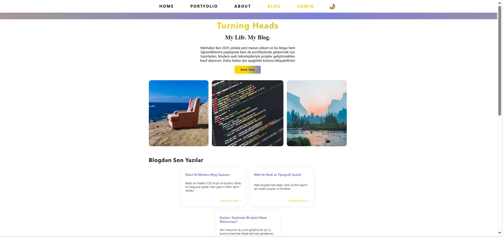
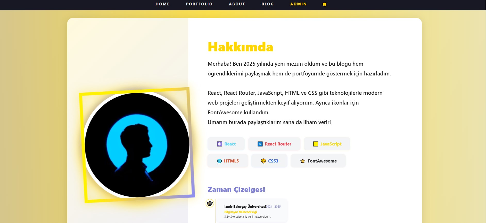
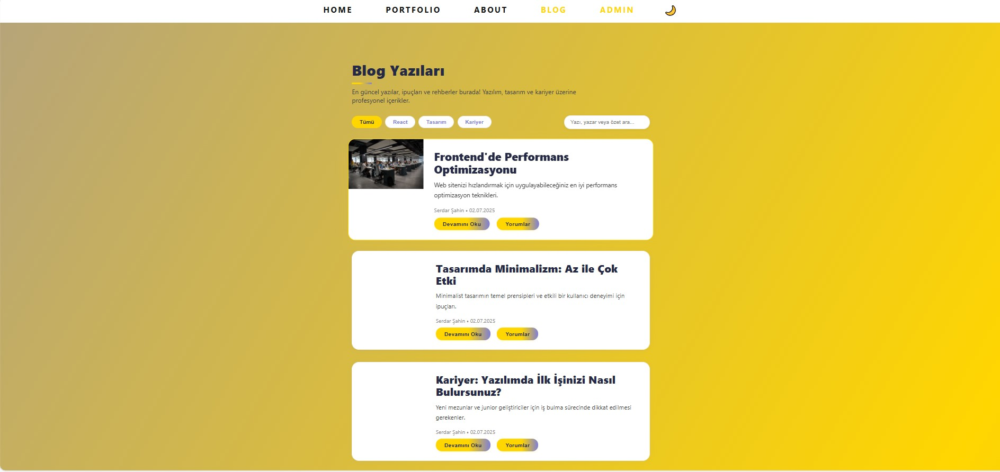
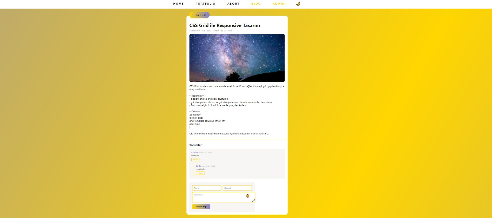
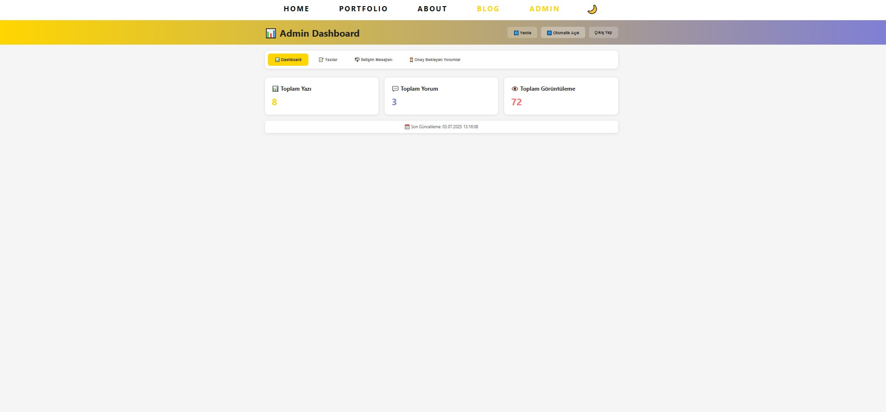

# Blogger Projesi

Bu proje, modern web teknolojileri kullanılarak geliştirilmiş tam özellikli bir blog platformudur. Kullanıcılar blog yazılarını okuyabilir, yorum yapabilir; yöneticiler ise içerik ve yorumları yönetebilir. Proje, mobil uyumlu ve PWA (Progressive Web App) desteklidir.

---

## İçindekiler
- [Genel Bakış](#genel-bakış)
- [Klasör Yapısı](#klasör-yapısı)
- [Kullanılan Teknolojiler](#kullanılan-teknolojiler)
- [Kurulum](#kurulum)
- [Backend (Node.js/Express)](#1-backend-nodejsexpress)
- [Frontend (React)](#2-frontend-react)
- [Özellikler](#özellikler)
- [PWA Desteği](#pwa-desteği)
- [Yorum Moderasyonu](#yorum-moderasyonu)


---

## Genel Bakış

Blogger, kullanıcı dostu arayüzü ve güçlü yönetim paneliyle hem okuyuculara hem de yöneticilere kolaylık sağlar. Mobil cihazlarda sorunsuz çalışır ve çevrimdışı kullanım için PWA desteği sunar.

---

## Klasör Yapısı

```
blogger/
  ├── blog-frontend/   # React tabanlı kullanıcı arayüzü
  │   ├── src/
  │   ├── public/
  │   ├── package.json
  │   └── ...
  ├── blog-backend/    # Node.js/Express tabanlı API ve sunucu
  │   ├── models/
  │   ├── routes/
  │   ├── middleware/
  │   ├── index.js
  │   └── ...
  ├── .gitignore
  └── README.md
```

---

## Kullanılan Teknolojiler

- **Frontend:**
  - React
  - React Router
  - Context API
  - CSS (Responsive, Media Query)
  - PWA (manifest.json, service worker)
- **Backend:**
  - Node.js
  - Express.js
  - MongoDB (Mongoose ile)
  - JWT ile kimlik doğrulama
  - CORS, dotenv, body-parser vb. yardımcı paketler

---

## Kurulum

### 1. Backend (Node.js/Express)

```bash
cd blog-backend
npm install
```

#### Ortam Değişkenleri
- `.env` dosyası oluşturup gerekli ayarları girin:
  ```
  MONGODB_URI=your_mongodb_connection_string
  JWT_SECRET=your_jwt_secret
  PORT=5000
  ```

#### Backend'i Başlat
```bash
npm start
```
- Varsayılan olarak [http://localhost:5000](http://localhost:5000) adresinde çalışır.

### 2. Frontend (React)

```bash
cd blog-frontend
npm install
npm start
```
- Varsayılan olarak [http://localhost:3000](http://localhost:3000) adresinde çalışır.

---

## Özellikler

- **Mobil Uyumlu ve Responsive Tasarım:** Tüm cihazlarda sorunsuz görünüm.
- **PWA Desteği:** Çevrimdışı çalışma, ana ekrana ekleme, hızlı yükleme.
- **Yorum Moderasyonu:** Yorumlar admin onayından geçmeden yayınlanmaz.
- **Admin Paneli:** Blog yazılarını, yorumları ve iletişim mesajlarını yönetme.
- **İletişim Formu:** Kullanıcılar mesaj gönderebilir, admin panelinden görüntülenir.
- **JWT ile Güvenli Giriş:** Admin girişi ve korumalı rotalar.
- **Veritabanı:** MongoDB ile esnek ve ölçeklenebilir veri yönetimi.

---

## PWA Desteği
- `manifest.json` ve `serviceWorker.js` dosyaları ile uygulama PWA olarak çalışır.
- Kullanıcılar uygulamayı ana ekrana ekleyebilir ve çevrimdışı kullanabilir.

---

## Yorum Moderasyonu
- Kullanıcılar blog yazılarına yorum ekleyebilir.
- Yorumlar, admin tarafından onaylanana kadar herkese açık olarak görünmez.
- Admin panelinden yorumları onaylayabilir veya silebilirsiniz.

---

## Katkı

1. Projeyi fork'layın.
2. Yeni bir branch oluşturun (`git checkout -b feature/ozellik-adi`).
3. Değişikliklerinizi yapın ve commit'leyin.
4. Branch'inizi push'layın (`git push origin feature/ozellik-adi`).
5. Pull request oluşturun.

---
# Blogger Projesi

Bu proje, modern web teknolojileri kullanılarak geliştirilmiş tam özellikli bir blog platformudur. Kullanıcılar blog yazılarını okuyabilir, yorum yapabilir; yöneticiler ise içerik ve yorumları yönetebilir. Proje, mobil uyumlu ve PWA (Progressive Web App) desteklidir.

---

## Ekran Görüntüleri







